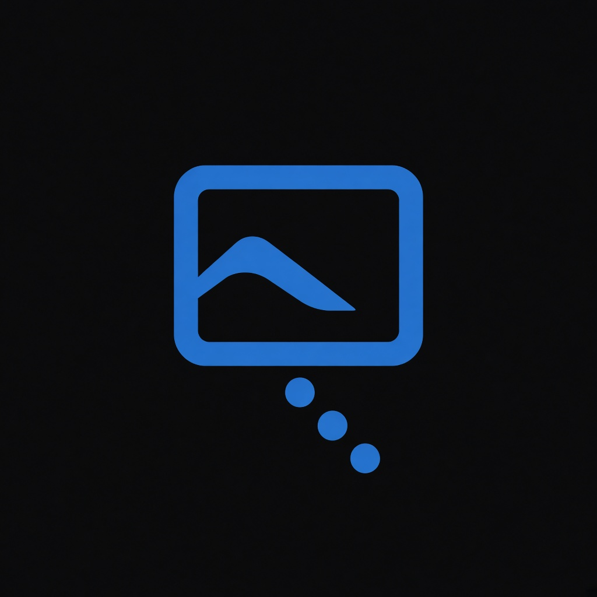
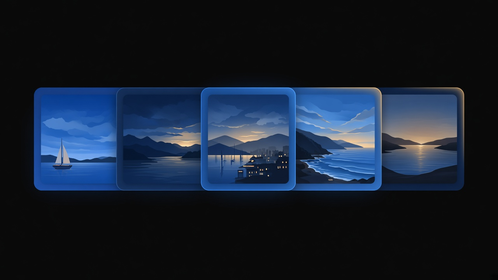

<p align="center">
  
</p>

<h1 align="center">ReelWalk</h1>

<p align="center">
  A fullscreen slideshow for the folders you already have.<br>
  Photos and videos, on Windows and Linux, in one file.
</p>

<p align="center">
  
  
  
</p>

<p align="center">
  
</p>

Point ReelWalk at a folder, including a large one on a network share. It starts showing files while the rest of the scan continues. The next launch can open on the last file, then check for anything new.

Only one copy runs at a time.

## Getting Started

The first run writes `ReelWalk.toml` beside the program, then exits. Add your folders to that file and run it again. `ReelWalk.library` is saved in the same folder.

### Windows

A published `ReelWalk.exe` already includes the .NET runtime and LibVLC. Nothing else to install.

To build this repo, install the .NET 10 SDK, then build from the repository root:

```powershell
winget install --id Microsoft.DotNet.SDK.10 --exact --accept-package-agreements --accept-source-agreements
dotnet build src/ReelWalk/ReelWalk.csproj -c Debug
```

### Linux

Videos need LibVLC from your distro. Building needs the .NET 10 SDK.

```bash
sudo apt install libvlc5 vlc-plugin-base
curl -fsSL https://dot.net/v1/dotnet-install.sh -o /tmp/dotnet-install.sh
bash /tmp/dotnet-install.sh --channel 10.0
export DOTNET_ROOT="$HOME/.dotnet"
export PATH="$DOTNET_ROOT:$PATH"
dotnet build src/ReelWalk/ReelWalk.csproj -c Debug
```

## What you get

<table>
<tr>
<td width="50%" align="center" valign="top">
<strong>One playlist</strong>
<br><br>
Photos and videos play together. You can limit it to either.
</td>
<td width="50%" align="center" valign="top">
<strong>Motion</strong>
<br><br>
Crossfade, zoom, wipe, and Ken Burns. Turn any of them off.
</td>
</tr>
<tr>
<td width="50%" align="center" valign="top">
<strong>Playback order</strong>
<br><br>
Random, newest, oldest, or name order. Random remembers the files you just saw.
</td>
<td width="50%" align="center" valign="top">
<strong>Large libraries</strong>
<br><br>
Recursive scan, folders you can ignore, and a saved file list so the next open is quick.
</td>
</tr>
<tr>
<td width="50%" align="center" valign="top">
<strong>Folder play</strong>
<br><br>
Press <kbd>F</kbd> or right-click. Play one folder, then return to the library.
</td>
<td width="50%" align="center" valign="top">
<strong>Look</strong>
<br><br>
Five themes, a contain or cover fit, and a tray menu for pause, next, and folders.
</td>
</tr>
</table>

| Kind | Formats |
|---|---|
| Photos | JPEG, PNG, GIF, BMP, TIFF, WebP |
| Also scanned | HEIC, HEIF, AVIF, HD Photo. Skipped when a file cannot be decoded |
| Videos | MP4, M4V, WMV, AVI, MOV, MKV, WebM |

A photo that will not open is skipped. New files show up on their own.

## Keys

Click the window so it has focus. Press <kbd>H</kbd> or <kbd>F1</kbd> for this list on screen. <kbd>Esc</kbd> closes the panel you are in, then quits.

These are the defaults. Change any of them under `[controls]` in `ReelWalk.toml`, or in Settings with <kbd>P</kbd>.

| Key | What it does |
|---|---|
| <kbd>←</kbd> <kbd>→</kbd>  or the wheel | Next or previous file |
| <kbd>Space</kbd> or middle-click | Pause |
| <kbd>R</kbd> <kbd>N</kbd> <kbd>S</kbd> | Random, newest by date taken, or name order |
| <kbd>V</kbd> | Photos, videos, or both |
| <kbd>F</kbd> or right-click | Folders around the current file |
| <kbd>P</kbd> | Settings |
| <kbd>K</kbd> | Ken Burns |
| <kbd>W</kbd> | Whole picture, or fill the screen |
| <kbd>Esc</kbd> | Close, then quit |

In Random, <kbd>←</kbd> walks back through the last files you saw (10, unless you change it). <kbd>→</kbd> returns along that trail before it picks a new one.

Videos play to the end and ignore the photo timer. Drag the bar at the bottom, or use <kbd>Ctrl</kbd> with the arrow keys, to move through a video. A burst of short jumps lands once, on the time you stop at.

<details>
<summary>Every default key</summary>

| Key | What it does |
|---|---|
| <kbd>Ctrl</kbd> + wheel, <kbd>Ctrl</kbd>+<kbd>↑</kbd> <kbd>Ctrl</kbd>+<kbd>↓</kbd>, <kbd>M</kbd> | Volume, or mute |
| <kbd>Ctrl</kbd>+<kbd>→</kbd> <kbd>Ctrl</kbd>+<kbd>←</kbd> | Jump 5 seconds |
| <kbd>Ctrl</kbd>+<kbd>Shift</kbd>+<kbd>→</kbd> <kbd>Ctrl</kbd>+<kbd>Shift</kbd>+<kbd>←</kbd> | Jump 30 seconds |
| <kbd>Home</kbd> <kbd>End</kbd> | First or last file |
| <kbd>Page Up</kbd> <kbd>Page Down</kbd> | Skip 10 files |
| <kbd>↑</kbd> <kbd>↓</kbd> | Photo time, one second at a time |
| <kbd>Enter</kbd> | Play the folder you are on |
| <kbd>→</kbd> in the folder list | Open a folder |
| <kbd>←</kbd> or <kbd>Backspace</kbd> | Leave a folder |
| Type | Jump to a folder name |
| <kbd>C</kbd> | Copy the file path |
| <kbd>I</kbd> | File info |
| <kbd>O</kbd> | Show the file in the file browser |
| <kbd>Delete</kbd> | Delete, after asking |
| <kbd>Ctrl</kbd>+<kbd>Delete</kbd> | Delete now |

In the folder list, **Subfolders** plays nested folders too. **This folder** plays only the files in the one you chose. When that folder finishes, the previous playlist comes back.

The path in the top-left corner opens the same folder menu. Right-click the tray icon for pause, next, previous, folders, edit config, and exit.

</details>

## Config

A short `ReelWalk.toml` is enough to begin:

```toml
paths = [
    "C:\\Photos",
    "D:\\Pictures",
]

ignore = [
    "C:\\Photos\\Skip",
]

[display]
duration = 8.0
theme = "HarborBlue"

[playback]
mode = "Random"
show = "Both"
```

`duration` is seconds per photo. `ignore` skips that folder and everything inside it. Network paths work. ReelWalk rewrites the file when it exits, so keyboard changes are kept.

Themes: Harbor Blue, Dark Slate, Jungle Green, Midnight Starry Sky, Pastel Dreams. Pick one in Settings, or set `theme`.

<details>
<summary>Full example</summary>

```toml
paths = [
    "C:\\Photos",
    "D:\\Pictures",
]

ignore = [
    "C:\\Photos\\Skip",
]

[display]
duration = 8.0
transition_percent = 20.0
fit = "Contain"          # Contain = whole picture, Cover = fill the screen
theme = "HarborBlue"     # HarborBlue | DarkSlate | JungleGreen | MidnightSky | PastelDreams
video_volume = 1.00      # 0.00 mute, 1.00 full

[playback]
mode = "Random"          # Random | NewestFirst | OldestFirst | Sequential
show = "Both"            # Both | Images | Videos
folder_mode = "Random"   # Random | Sequential
folder_subfolders = true
history = 10
last_index = 0
last_path = ""

[transitions]
enabled = [
    "Crossfade",
    "MorphZoom",
    "SoftWipe",
    "ParallaxReveal",
    "ScaleDissolve",
]
ken_burns = true

[controls]
skip = 10
seek_seconds = 5
seek_fast_seconds = 30
next = "Right"
previous = "Left"
pause = "Space"
settings = "P"
folder = "F"
close = "Escape"
```

Key names match the app: `Left`, `Right`, `PageUp`, `Space`, `Delete`, `F1`. Add `Ctrl+`, `Shift+`, or `Alt+` in front.

</details>

## Build

From the repository root, with the .NET 10 SDK (Git Bash, WSL, or Linux):

```sh
./scripts/build.sh
```

That writes two self-contained files:

| File | System |
|---|---|
| `build/win-x64/ReelWalk.exe` | Windows x64 |
| `build/linux-x64/ReelWalk` | Linux x64 |

One target only:

```sh
./scripts/build.sh --windows
./scripts/build.sh --linux
```

`bin/` and `obj/` under `src/ReelWalk/` are removed after a successful publish. Copy the file for the system you are on. Your `ReelWalk.toml` and `ReelWalk.library` stay beside it.

## License

[MIT](LICENSE). Copyright (c) 2026.

ReelWalk started as a port of [rSlide](https://github.com/rayone/rSlide) and was rewritten for Avalonia. Playback order, the transition set, and Ken Burns motion come from that project.
